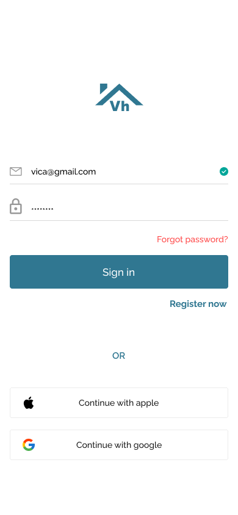
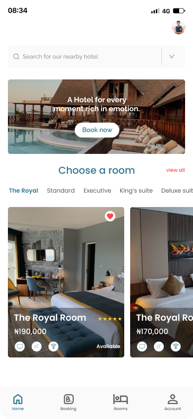
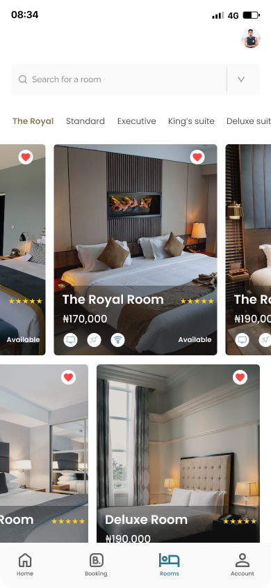
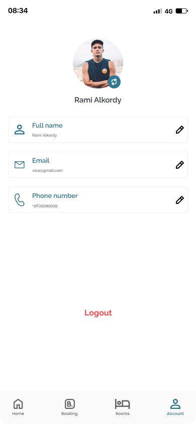

# Vica Hotel App 🏨

A **Flutter-based hotel booking application** with secure Laravel authentication and offline-first room management using SQLite. Built to deliver a seamless user experience for browsing and reserving hotel rooms, even without internet connectivity.

[](https://flutter.dev)

## Screenshots & Demo 📸🎬  

### App Screenshots

<div align="center" style="display: flex; flex-wrap: wrap; justify-content: center; gap: 50px;">
  
  
  
  
  
  
</div>


## Demo GIF 🎬  
<p align="center">
  
</p>

---

## Features ✨
- **Secure Authentication**: JWT-based login/registration via **Laravel API**.
- **Offline Room Management**: Browse and manage hotel rooms locally using **SQLite** (`sqflite`).
- **Responsive UI**: Interactive elements like image carousels, calendars, and filters.
- **User Profile**: Edit personal details and profile images (synced with Laravel backend).
- **State Management**: Efficient UI-state handling with **Provider/Bloc**.
- **Localization**: Support for multiple languages (English, Arabic).
- **Modular Codebase**: Clean separation of concerns (`models`, `providers`, `services`).

---

## Installation 🛠️
### Prerequisites
- Flutter SDK (>=3.13.8)
- Dart (>=3.1.0)
- Android Studio/Xcode (for emulator setup)

### Steps
1. **Clone the repository**:
   ```bash
   git clone https://github.com/abdalmjeedalshami/vica_hotel_app.git
   cd vica_hotel_app

2. **Install dependencies**:
   ```bash
   flutter pub get

3. **Run the app**:
   ```bash
   flutter run

## Technology Stack 🛠️

### Frontend
<p align="left">
  
  
  
  
</p>

### Backend
<p align="left">
  
  
  
</p>

### Database
<p align="left">
  
  
</p>

### Tools & Infrastructure
<p align="left">
  
  
  
  
</p>

### Architecture & Practices
- Clean Architecture
- MVC Pattern
- Offline-First Design
- RESTful APIs
- State Management (Provider)
- Secure Authentication (JWT)

## 🤝 Contributing

Contributions are welcome and appreciated!  
If you'd like to improve this project:

1. Fork the repository
2. Create your feature branch: `git checkout -b feature/my-feature`
3. Commit your changes: `git commit -m "Add my feature"`
4. Push to the branch: `git push origin feature/my-feature`
5. Open a pull request

Please make sure your code follows the existing style and includes proper documentation when necessary.
